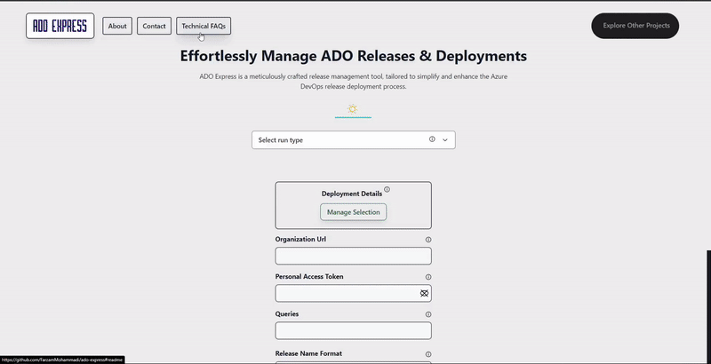

# ADO Express 🚀


Welcome to the codebase for ADO Express - your new go-to release management tool. This application is designed to streamline and optimize the Azure DevOps release deployment process. Intuitive, efficient, and powerful - ADO Express will transform the way you manage releases.

This repository houses both the frontend and the backend of ADO Express. Keep reading to learn how to get them up and running on your local machine!


## ✨ UI Preview



## 🎨 Frontend

The frontend of ADO Express is a sleek and modern web application. Let's get it running:

1. Navigate into the frontend directory:
   ```sh
   cd ado_express_app
   ```
2. Run the development server:
   ```sh
   npm run dev
   ```
   Voila! You should now have the ADO Express web application running locally.

## 🔧 Backend (API)

The backend (API) of ADO Express powers all of the magic behind the scenes. To get it running, follow these steps:

### Preparation

First, you need to set up a virtual environment and install the necessary dependencies:

1. Create a virtual environment:
   ```sh
   python -m venv ./venv
   ```
2. Activate the virtual environment:
   - Windows:
     ```sh
     .\venv\Scripts\activate
     ```
   - Linux/macOS:
     ```sh
     source venv/bin/activate
     ```
3. Install Dependencies:
   ```sh
   pip install -r requirements.txt
   ```

### Run the API

With the virtual environment set up, you can now run the API:

1. Navigate into the API directory:
   ```sh
   cd ado_express_api
   ```
2. Start the application:
   ```sh
   daphne asgi:application
   ```

That's it! You should now have the ADO Express API running locally.

## 🖥️ Want to Run the CLI Version?

No problem at all! We understand some people love the good ol' command-line interface. If you're one of those CLI aficionados, and you'd like to run the CLI version of ADO Express, we've got you covered.

For all things CLI, navigate to the CLI's dedicated README in the `./ado_express` directory.

Here's a quick teleport for you: [CLI README](./ado_express/README.md).

You'll find all the instructions, tips, and tricks for running the CLI version there. Have fun exploring!

## 🌟 Shine Bright

ADO Express is more than just a tool; it's a game changer. With an emphasis on usability and performance, this app aims to simplify the complexities of release management, allowing you to focus on what truly matters - creating outstanding software.

Feel free to explore the repository, try out the application, and even contribute. Enjoy your journey with ADO Express!

## 🎥 Demo

Coming soon! Keep an eye on this space for a walkthrough video, showcasing ADO Express in action.

## 💡 Features

ADO Express boasts a range of features to simplify your Azure DevOps release management process. Here are some of the highlights:

- **Automated Release Management**: ADO Express automates your entire release management process, saving you time and ensuring uniformity in all your deployments. It prevents unwanted releases in deployments, and takes you from start to finish in your Continuous Deployment pipeline.

- **Search and Export**: With ADO Express, you can easily search through your releases and export your results to an Excel file. Whether you're using an ADO query or a deployment plan Excel file, ADO Express provides you with a detailed log of your release deployments.

- **Detailed Release Deployment**: ADO Express offers three types of detailed deployments: via query, via release number, and via environment. Each deployment type comes with its unique advantages, giving you the flexibility to choose the deployment method that best suits your needs.

- **Crucial Release Deployment Management**: ADO Express lets you mark certain releases as 'crucial.' These crucial deployments are run first, and in case of a deployment error, the application attempts to rollback and stop the processes.

- **Easy Run Options**: ADO Express provides you with a variety of ways to run the tool, from Docker to local execution, giving you the flexibility to choose the method that fits best in your workflow.

- _And many more..._: Dive in and discover what ADO Express has in store!

## 🛠️ Built With

ADO Express utilizes a robust tech stack:

- Frontend: **Svelte**, **Typescript**, **Tailwind**
- Backend: **Python**, **Django**

## 🤝 Contributions & Feedback

While we don't currently have a formal contribution guide, we still warmly welcome contributions from all! If you have suggestions, bug reports, or want to contribute code, please feel free to open an issue or pull request on our GitHub repository.

Also, if you encounter any issues or have ideas for enhancements, we would love to hear from you! Just head over to the [ADO Express Issues](https://github.com/FarzamMohammadi/ado-express/issues) page and drop us a note.

Whether you're providing feedback, reporting issues, or contributing to the code, your involvement is what makes this project shine. Thanks for being a part of ADO Express!

## 📝 License

This project is licensed under the terms of the [MIT license](LICENSE).

## 📮 Get in Touch

Have questions, suggestions, or just want to chat about ADO Express? Reach out!

- Farzam Mohammadi: [Email](mailto:farzammohammadia@gmail.com)
